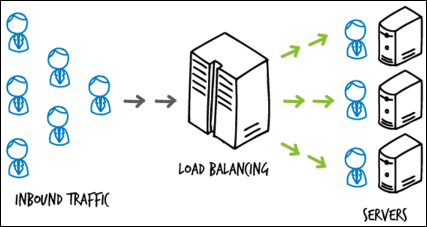

# 로드 벨런싱이란?

- 애플리케이션을 지원하는 리소스 풀 전체에 네트워크 트래픽을 균등하게 배포하는 방법이다.

## 로드벨런싱을 하기 위한 준비
- 선생님 공유폴더에서 docker-phpserver-maste안에 있는 파일 aws에 호스트 계정으로 옮긴다.

- phpserver이미지 생성하기
```
docker build -t phpserver:1.0 .
```

- 실습을 위한 컨테이너 3개 생성하기
```
docker run -itd -p 5001:80 \
	-h nginx-lb01 \
	-v ./lb01:/var/log/apache2 \
	-e SERVER_PORT=5001 \
	--name=nginx-lb01 \
	phpserver:1.0


docker run -itd -p 5002:80 \
	-h nginx-lb02 \
	-v ./lb02:/var/log/apache2 \
	-e SERVER_PORT=5002 \
	--name=nginx-lb02 \
	phpserver:1.0

docker run -itd -p 5003:80 \
	-h nginx-lb03 \
	-v ./lb03:/var/log/apache2 \
	-e SERVER_PORT=5003 \
	--name=nginx-lb03 \
	phpserver:1.0
```

- 옮긴 파일중에 index.php3파일들을 각각 컨테이너 안에 복사하기
```
docker cp index.php3 nginx-lb01:/var/www/html/index.php
docker cp index.php3 nginx-lb02:/var/www/html/index.php
docker cp index.php3 nginx-lb03:/var/www/html/index.php
```

- /etc/nginx 폴더안에 nginx.conf 파일 수정하기 
```
# include 밑에 다 지우기
100 치고 dd 누르기 현재 위치에서 100번째 까지 지우기

# 아래 코드 지운 부분에 붙여넣기
events {
        worker_connections 1024;
}

http {
        upstream backend-lb {
                server 127.0.0.1:5001;
                server 127.0.0.1:5002;
                server 127.0.0.1:5003;
        }

        server {
                listen 80 default_server;
                listen [::]:80 default_server;

                # 연결 프락시 정보
                location / {
                        proxy_pass      http://backend-lb;
                }
        }
}
```

- nginx 재실행 하기
```
sudo service nginx restart
sudo service nginx status
```
